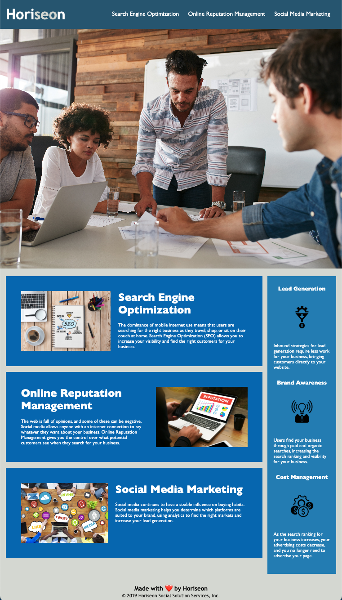

# Bootcamp Challenge 1: Code Refactor

## Description

In this code refactor, I simplified and reorganized the HTML and CSS of the Horiseon Social Solution Services' home page. The overall goal was to improve the webpage in functionality (through fixing bugs like the SEO nav button not directing anywhere), accessibility and SEO (by adding accessibility attributes), and developer organization (through simplifying, restructuring, and providing detailed comments in the HTML and CSS).
 
The main learnings I gained from this project:
- A deeper understanding of different CSS elements and their attributes.
- Ways to simplify code to make it easier to digest and edit in the future (i.e. making it so when you adjust the h2 CSS it applies to all h2 elements in the HTML.)
- How to organize your code in a clear way for the benefit of yourself and any other developers that work on the page.

## Installation 

To install and work on the refactored code, clone down the index.html, README.md, and assets folder (containing image and CSS files) to your machine and open in a source code editor.

## Usage

The purpose of the page is to provide Horiseon a place to send consumers to learn more about their capabilities and provide a place to educate consumers more on the basics of digital marketing and SEO.
 
When implemented on the site, the page will look like the following:

## Credits

Starter code provided by University of Denver Full Stack Bootcamp course. 
